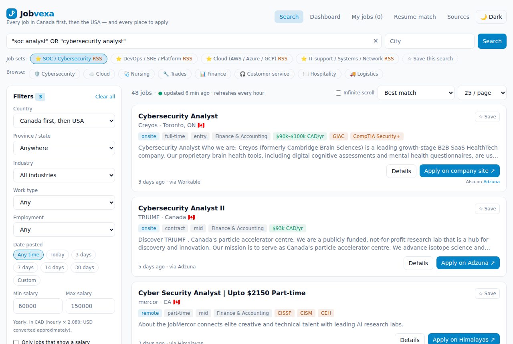
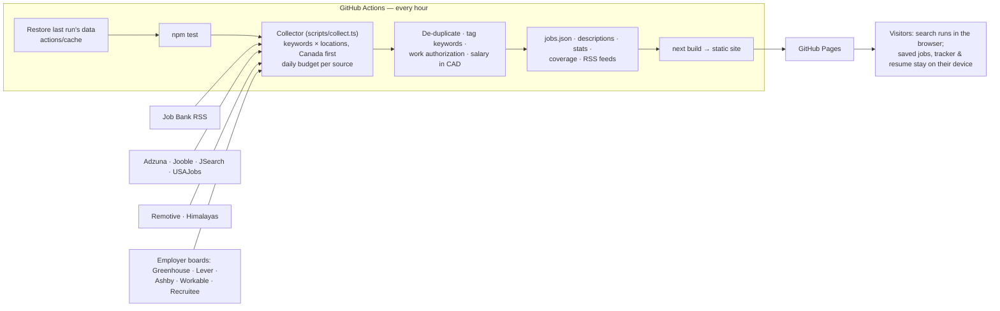
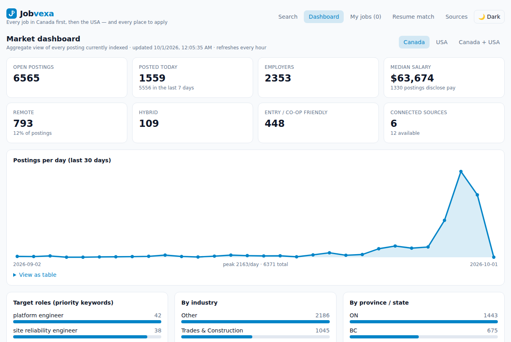
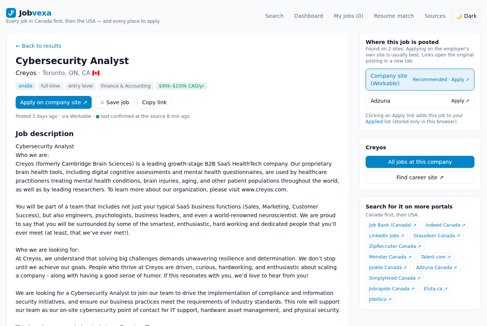
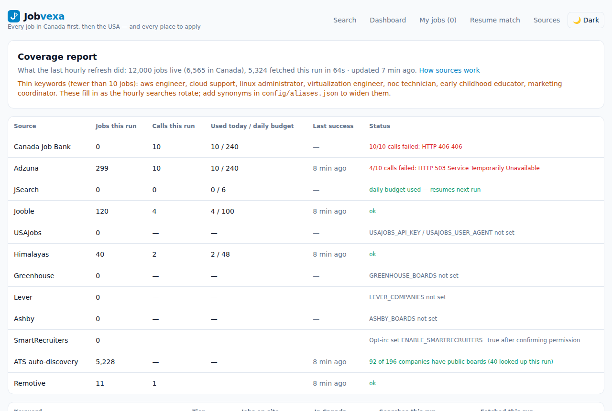

# Jobvexa — every job in Canada first, then the USA

**Live site: https://karthic71.github.io/jobvexa/** · Created by **Karthic** ([@Karthic71](https://github.com/Karthic71)) · MIT licence

Jobvexa is a free job search site for **all industries**, **Canada first, then the USA and remote**. It collects postings every hour from official and licensed job APIs and from employers' own job boards, removes duplicates, and shows **every site where each job is posted** so you can apply in one click. It focuses first on DevOps / SRE / Platform, Cloud, SOC / Cybersecurity and IT support roles.

It runs **100% free**: a GitHub Action collects jobs hourly and republishes a static site on GitHub Pages. No server, no database, no accounts.



> Screenshots are created by the *Update README screenshots* workflow (Actions tab → Run workflow). Until it has run once, the images above and below won't show.

## How it works



## Features
- **Search** with Enter or the button: `"exact phrase"`, `soc OR "security analyst"`, `devops -senior`; synonyms (e.g. *SRE* finds *Site Reliability Engineer*); matches full job descriptions via keyword tags.
- **Job sets** — SOC / Cybersecurity, DevOps / SRE / Platform, Cloud, IT support — with **"N new"** badges, **RSS alert feeds**, and your own saved searches.
- **Filters**: Canada first / Canada only / USA only, province or state, city, industry, remote/hybrid/on-site, employment type, date posted, salary (yearly CAD), experience level (entry & mid first), certifications, tools, skills, and **work authorization** (hide "citizens only", "PR only", "clearance", "no sponsorship"; or show only "sponsorship offered").
- **Where this job is posted** — every portal a job was found on (company site first) with an Apply button for each.
- **Application tracker** — Applied → Interview → Offer / Rejected, notes, CSV export.
- **Resume match** — paste your resume; it's analysed in the browser only. Match % on every job, what you have and what's missing, sort by best match.
- **ATS check before you apply** — on every job page (and the “ATS check” link on each card): an ATS-style score out of 100 and a job-description match %, with a breakdown (hard skills & tools, keywords, job title, years of experience, education, readable formatting), the missing keywords to copy, and tips. Uses your saved resume automatically; scores show in the application tracker. Browser-only — nothing is uploaded.
- **Dashboard** (Canada / USA): totals, 30-day trend, target roles, industries, provinces, cities, employers, skills, tools, certifications.
- **Coverage report** — what each hourly run did: calls vs budget, last success per source, jobs per keyword, thin keywords.
- Company pages, job pages, light/dark mode, Terms / Privacy / Data attribution.

| Dashboard | Job page | Coverage |
|---|---|---|
|  |  |  |

## Sources
| Source | Key needed | Notes |
|---|---|---|
| **Job Bank** (Government of Canada) | no | Public RSS feed; robots.txt + crawl delay obeyed; Open Government Licence – Canada. |
| **Employer boards** (Greenhouse, Lever, Ashby, Workable, Recruitee) | no | ~200 employers in `config/companies.txt`, found automatically. |
| **Remotive**, **Himalayas** | no | Remote jobs open to Canada/USA; link back + credit required (done). |
| **Adzuna** | `ADZUNA_APP_ID`, `ADZUNA_APP_KEY` | Best free volume, all industries. |
| **JSearch** | `OPENWEBNINJA_API_KEY` (or old `RAPIDAPI_KEY`) | Google for Jobs data incl. every portal a job is on. RapidAPI closed new sign-ups in Sept 2026 — get a free key at openwebninja.com. |
| **Jooble** | `JOOBLE_API_KEY` | Small/mid-size employers. |
| **USAJobs** | `USAJOBS_API_KEY`, `USAJOBS_USER_AGENT` | US federal jobs. |

Not indexed: LinkedIn, Indeed, Glassdoor (their terms forbid it) — every search has pre-filled links to them instead.

Add keys at **Settings → Secrets and variables → Actions → New repository secret**. Optional *Variables* there: `DAILY_CALLS_ADZUNA` (240), `DAILY_CALLS_JSEARCH` (6), `DAILY_CALLS_JOOBLE` (100), `DAILY_CALLS_USAJOBS` (200), `DAILY_CALLS_JOBBANK` (240), `DAILY_CALLS_HIMALAYAS` (48), `MAX_JOBS` (15000), `DISABLE_JOBBANK` / `DISABLE_REMOTIVE` / `DISABLE_HIMALAYAS` / `DISABLE_ATS_DISCOVERY` (`true`).

## Choosing what gets searched
- **`config/keywords.txt`** — one keyword per line. `[priority]` keywords are searched most (Canada-wide 3 pages, Canada-remote, 10 big Canadian cities, then USA). `[general]` keywords keep every industry covered.
- **`config/aliases.json`** — synonyms, e.g. `"site reliability engineer": ["sre", ...]`.
- **`config/companies.txt`** — employers whose own job boards are checked every hour.
- Check the result in the **Coverage report** page after the next hourly run.

## Updating the site
- **In the browser:** open https://github.com/Karthic71/jobvexa, press the **.** key, edit, then *Source Control → Commit & Push*.
- **From a folder on Windows:** put the project in a folder, double-click **`publish-to-github.bat`**. It copies the workflow files from `setup/` into `.github/`, commits, pulls any newer changes and pushes.
- The site rebuilds itself after each push and then every hour.

## Run locally (optional)
```bash
npm install
npm run collect:demo   # demo data (or: npm run collect — uses keys from .env)
npm run dev            # http://localhost:3000
npm test               # unit + collector tests
```

## Project layout
- `scripts/collect.ts` — hourly collector (keyword lanes, budgets, merge, coverage, RSS).
- `lib/aggregator/` — sources, normalisation, fingerprint de-dupe, keywords/synonyms, search syntax, work-auth, salary, resume match, ATS check (`ats.ts`), stats.
- `app/` — pages: `/`, `/job/?id=`, `/company/?name=`, `/dashboard`, `/saved` (My jobs & tracker), `/match`, `/coverage`, `/sources`, legal pages.
- `setup/` — workflow files (`deploy.yml`, `screenshots.yml`, `dependabot.yml`) copied into `.github/` by the publish script.
- `SECURITY.md` — threat model. `CHANGELOG.md` — what changed.

## Honest limits
- No site can list every job: LinkedIn and Indeed don't allow copying their listings.
- "Live" = refreshed hourly; GitHub may start scheduled runs a few minutes late.
- Details like skills, level, salary and work authorization are detected automatically — always check the original posting.
- Free API tiers are small; budgets spread them over the day.

## Credits
Created by **Karthic** (karthicjr17@gmail.com). Job data © its respective sources — see the Data attribution page.
